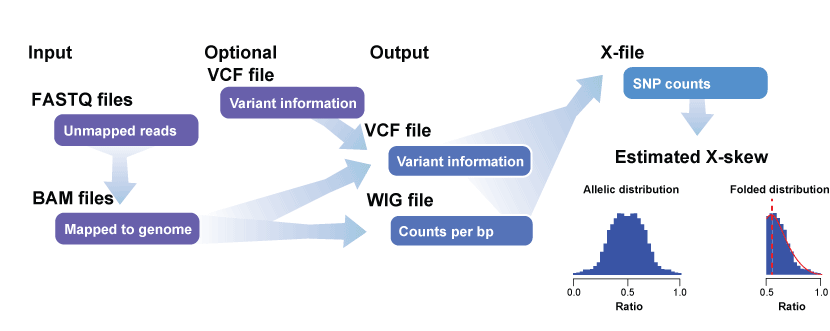

# phasXer 
phasXer: Phasing X-inactivation through expression. The purpose of this package is to estimate XCI from RNA-seq expression data. 

# Introduction 
Due to the stochasticity of the X-inactivation - differences in timing of silencing in cell lineages, survival, selection and other unknown influences - an imbalance is typically observed. This imblance, or X-skewing, is a driver of phenotypic variation and mosaicism although in disease contexts the breadth and impact of this is not entirely understood. Severe mutations can often be obscured from presenting in females or appear in milder forms as the ‘unhealthy’ X may be preferentially silenced during XCI. Males, having no compensatory mechanism for such variants, exhibit disease or if embryonically lethal, fail to survive. X-skewing is implicated in atherosclerosis, cardiovascular disease, inflammatory and autoimmune diseases.

 

# What you can do with this package
 

# What you need to get started
## Data
- RNA-seq (bulk or single cell) mapped reads in the form of an alignment (BAM) file or reads (FASTQ) files 
- Genotype (VCF). This is optional if you wish to use the RNA-seq data to call your variants. 

## System and tool requirements
- GATK
- IGVtools

## What is in this user guide
Nothing just yet! 
## How to get help
Ask us! Please reach out.
## Installation
Using devtools:
```
# install.packages("devtools")
devtools::install_github("sarbal/phasXer")
```
